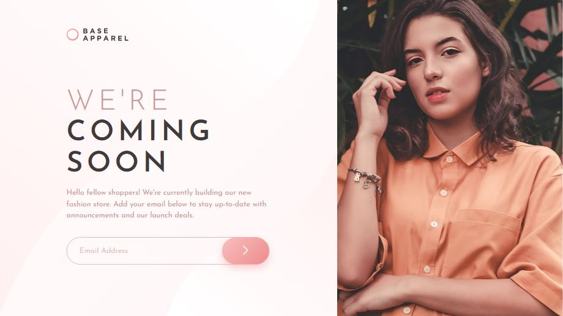

# Frontend Mentor - Base Apparel coming soon page solution

This is a solution to the [Base Apparel coming soon page challenge on Frontend Mentor](https://www.frontendmentor.io/challenges/base-apparel-coming-soon-page-5d46b47f8db8a7063f9331a0). Frontend Mentor challenges help you improve your coding skills by building realistic projects.

## Table of contents

- [Overview](#overview)
  - [The challenge](#the-challenge)
  - [Screenshot](#screenshot)
  - [Links](#links)
- [My process](#my-process)
  - [Built with](#built-with)
- [Author](#author)

## Overview

### The challenge

Users should be able to:

- View the optimal layout for the site depending on their device's screen size
- See hover states for all interactive elements on the page
- Receive an error message when the `form` is submitted if:
  - The `input` field is empty
  - The email address is not formatted correctly

### Screenshot

### Links

- Solution URL: [solution URL here](https://www.frontendmentor.io/solutions/base-apparel-coming-soon-g3TbkQ2gON)
- Live Site URL: [live site URL here](https://gilangr1440.github.io/base-apparel-coming-soon/)

## My process

### Built with

- Semantic HTML5 markup
- CSS custom properties
- Flexbox
- CSS Grid
- Mobile-first workflow
- SCSS
- BEM Notation
- Javascript DOM
- Regular Expression

## Author

- LinkedIn - [Gilang Ramadhan](https://www.linkedin.com/in/gilangr1440/)
- Frontend Mentor - [@gilangr1440](https://www.frontendmentor.io/profile/gilangr1440)
- Instagram - [@gilangr1440](https://www.instagram.com/gilangr1440)
